# Lottery

基于Springboot，Dubbo 等开发的分布式抽奖系统

# 第一部分 领域开发

## 1. 环境 配置 规范


## 2. 搭建(DDD + RPC)架构

DDD（Domain-Driven Design 领域驱动设计）是由Eric Evans最先提出，目的是对软件所涉及到的领域进行建模，以应对系统规模过大时引起的软件复杂性的问题。整个过程大概是这样的，开发团队和领域专家一起通过 通用语言(Ubiquitous Language)去理解和消化领域知识，从领域知识中提取和划分为一个一个的子领域（核心子域，通用子域，支撑子域），并在子领域上建立模型，再重复以上步骤，这样周而复始，构建出一套符合当前领域的模型。

依靠领域驱动设计的设计思想，通过事件风暴建立领域模型，合理划分领域逻辑和物理边界，建立领域对象及服务矩阵和服务架构图，定义符合DDD分层架构思想的代码结构模型，保证业务模型与代码模型的一致性。通过上述设计思想、方法和过程，指导团队按照DDD设计思想完成微服务设计和开发。

- 拒绝泥球小单体、拒绝污染功能与服务、拒绝一加功能排期一个月
- 架构出高可用极易符合互联网高速迭代的应用服务
- 物料化、组装化、可编排的服务，提高人效

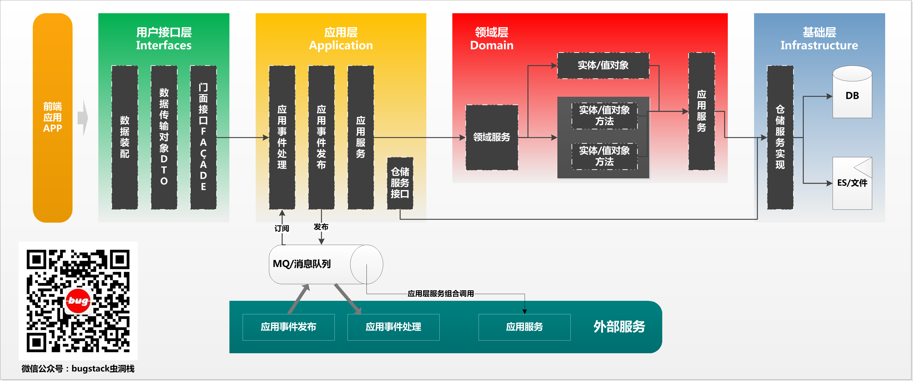

- **应用层{application}**

  - 应用服务位于应用层。用来表述应用和用户行为，负责服务的组合、编排和转发，负责处理业务用例的执行顺序以及结果的拼装。

  - 应用层的服务包括应用服务和领域事件相关服务。

  - 应用服务可对微服务内的领域服务以及微服务外的应用服务进行组合和编排，或者对基础层如文件、缓存等数据直接操作形成应用服务，对外提供粗粒度的服务。

  - 领域事件服务包括两类：领域事件的发布和订阅。通过事件总线和消息队列实现异步数据传输，实现微服务之间的解耦。

- **领域层{domain}**

  - 领域服务位于领域层，为完成领域中跨实体或值对象的操作转换而封装的服务，领域服务以与实体和值对象相同的方式参与实施过程。

  - 领域服务对同一个实体的一个或多个方法进行组合和封装，或对多个不同实体的操作进行组合或编排，对外暴露成领域服务。领域服务封装了核心的业务逻辑。实体自身的行为在实体类内部实现，向上封装成领域服务暴露。

  - 为隐藏领域层的业务逻辑实现，所有领域方法和服务等均须通过领域服务对外暴露。

  - 为实现微服务内聚合之间的解耦，原则上禁止跨聚合的领域服务调用和跨聚合的数据相互关联。

- **基础层{infrastructure}**

  - 基础服务位于基础层。为各层提供资源服务（如数据库、缓存等），实现各层的解耦，降低外部资源变化对业务逻辑的影响。

  - 基础服务主要为仓储服务，通过依赖反转的方式为各层提供基础资源服务，领域服务和应用服务调用仓储服务接口，利用仓储实现持久化数据对象或直接访问基础资源。

- **接口层{interfaces}**
  - 接口服务位于用户接口层，用于处理用户发送的Restful请求和解析用户输入的配置文件等，并将信息传递给应用层。

**DDD是在MVC的基础上可以更加明确了房间的布局**

DDD结构它是一种充血模型结构，所有的服务实现都以领域为核心，应用层定义接口，领域层实现接口，领域层定义数据仓储，基础层实现数据仓储中关于DAO和Redis的操作，但同时几方又有互相的依赖。那么这样的结构再开发独立领域提供 http 接口时候，并不会有什么问题体现出来。但如果这个时候需要引入 RPC 框架，就会暴露问题了，因为使用 RPC 框架的时候，需要对外提供描述接口信息的 Jar 让外部调用方引入才可以通过反射调用到具体的方法提供者，那么这个时候，RPC 需要暴露出来，而 DDD 的系统结构又比较耦合，怎么进行模块化的分离就成了问题点。所以我们本章节在模块系统结构搭建的时候，也是以解决此项问题为核心进行处理的。

**DDD + RPC，模块分离系统搭建**

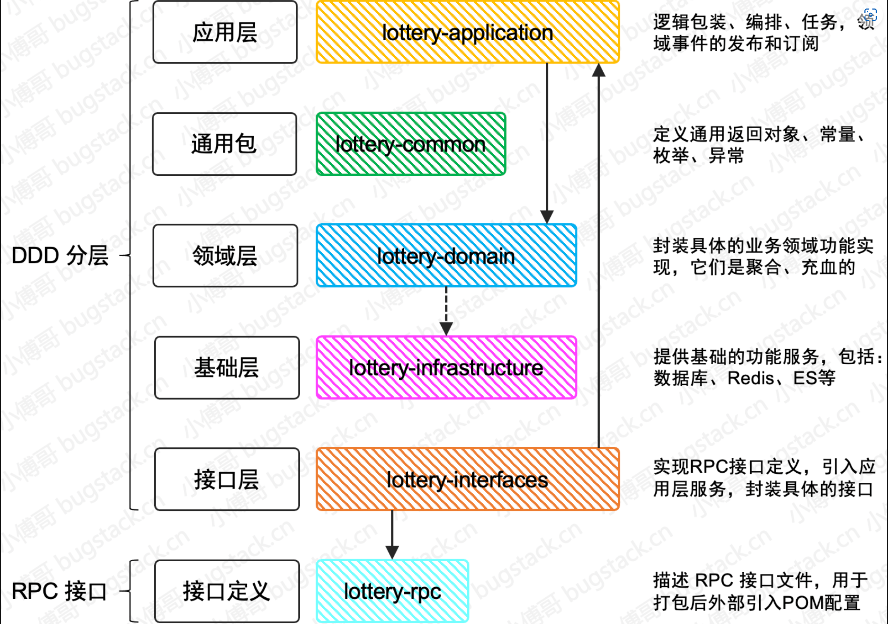

如果按照模块化拆分，那么会需要做一些处理，包括：

1. 应用层，不再给领域层定义接口，而是自行处理对领域层接口的包装。否则领域层既引入了应用层的Jar，应用层也引入了领域层的Jar，就会出现循环依赖的问题。
2. 基础层中的数据仓储的定义也需要从领域层剥离，否则也会出现循环依赖的问题。
3. RPC 层定义接口描述，包括：入参Req、出参Res、DTO对象，接口信息，这些内容定义出来的Jar给接口层使用，也给外部调用方使用。

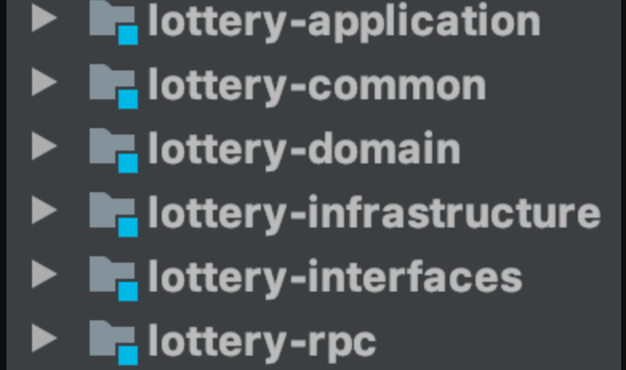


## 3. 跑通广播模式RPC过程调用

### 一、创建抽奖活动表

抽奖活动的设计和开发过程中，涉及到的表信息包括：活动表、奖品表、策略表、规则表、用户参与表、中奖信息表等。

首先创建一个活动表，用于实现系统对数据库的CRUD操作，也就可以被RPC接口调用，在后续再进行优化。

**活动表(activity)**

```sql
CREATE TABLE `activity` (
  `id` bigint(20) NOT NULL AUTO_INCREMENT COMMENT '自增ID',
  `activity_id` bigint(20) NOT NULL COMMENT '活动ID',
  `activity_name` varchar(64) CHARACTER SET utf8mb4 DEFAULT NULL COMMENT '活动名称',
  `activity_desc` varchar(128) CHARACTER SET utf8mb4 DEFAULT NULL COMMENT '活动描述',
  `begin_date_time` datetime DEFAULT NULL COMMENT '开始时间',
  `end_date_time` datetime DEFAULT NULL COMMENT '结束时间',
  `stock_count` int(11) DEFAULT NULL COMMENT '库存',
  `take_count` int(11) DEFAULT NULL COMMENT '每人可参与次数',
  `state` tinyint(2) DEFAULT NULL COMMENT '活动状态：1编辑、2提审、3撤审、4通过、5运行(审核通过后worker扫描状态)、6拒绝、7关闭、8开启',
  `creator` varchar(64) CHARACTER SET utf8mb4 DEFAULT NULL COMMENT '创建人',
  `create_time` datetime DEFAULT CURRENT_TIMESTAMP COMMENT '创建时间',
  `update_time` datetime DEFAULT CURRENT_TIMESTAMP COMMENT '修改时间',
  PRIMARY KEY (`id`),
  UNIQUE KEY `unique_activity_id` (`activity_id`)
) ENGINE=InnoDB AUTO_INCREMENT=2 DEFAULT CHARSET=utf8mb4 COLLATE=utf8mb4_bin COMMENT='活动配置';

```

活动表：是一个用于配置抽奖活动的总表，用于存放活动信息，包括：ID、名称、描述、时间、库存、参与次数等。

### 二、POM 文件配置

按照现有工程的结构模块分层，包括：

- lottery-application，应用层，引用：`domain`
- lottery-common，通用包，引用：`无`
- lottery-domain，领域层，引用：`infrastructure`
- lottery-infrastructure，基础层，引用：`无`
- lottery-interfaces，接口层，引用：`application`、`rpc`
- lottery-rpc，RPC接口定义层，引用：`common`

**lottery-rpc配置**

```xml
<parent>
    <artifactId>Lottery</artifactId>
    <groupId>com.banana69.lottery</groupId>
    <version>1.0-SNAPSHOT</version>
</parent>
<modelVersion>4.0.0</modelVersion>
<artifactId>lottery-rpc</artifactId>

<packaging>jar</packaging>

<dependencies>
    <dependency>
        <groupId>cn.itedus.lottery</groupId>
        <artifactId>lottery-common</artifactId>
        <version>1.0-SNAPSHOT</version>
    </dependency>
</dependencies>

<build>
    <finalName>lottery-rpc</finalName>
    <plugins>
        <!-- 编译plugin -->
        <plugin>
            <groupId>org.apache.maven.plugins</groupId>
            <artifactId>maven-compiler-plugin</artifactId>
            <configuration>
                <source>${jdk.version}</source>
                <target>${jdk.version}</target>
                <compilerVersion>1.8</compilerVersion>
            </configuration>
        </plugin>
    </plugins>
</build>
```

**lottery-interfaces配置**

```xml
<artifactId>lottery-interfaces</artifactId>

<packaging>war</packaging>

<dependencies>
    <dependency>
        <groupId>org.springframework.boot</groupId>
        <artifactId>spring-boot-starter-web</artifactId>
    </dependency>
    ...
</dependencies>

<build>
    <finalName>Lottery</finalName>
    <resources>
        <resource>
            <directory>src/main/resources</directory>
            <filtering>true</filtering>
            <includes>
                <include>**/**</include>
            </includes>
        </resource>
    </resources>
    <testResources>
        <testResource>
            <directory>src/test/resources</directory>
            <filtering>true</filtering>
            <includes>
                <include>**/**</include>
            </includes>
        </testResource>
    </testResources>
    <plugins>
        <plugin>
            <groupId>org.springframework.boot</groupId>
            <artifactId>spring-boot-maven-plugin</artifactId>
        </plugin>
        <plugin>
            <groupId>org.apache.maven.plugins</groupId>
            <artifactId>maven-compiler-plugin</artifactId>
            <configuration>
                <source>8</source>
                <target>8</target>
            </configuration>
        </plugin>
    </plugins>
</build>

```

lottery-interfaces 是整个程序的出口，也是用于构建 War 包的工程模块，所以你会看到一个 `<packaging>war</packaging>` 的配置。

在 dependencies 会包含所有需要用到的 SpringBoot 配置，也会包括对其他各个模块的引入。

在 build 构建配置上还会看到一些关于测试包的处理，比如这里包括了资源的引入也可以包括构建时候跳过测试包的配置。

**配置广播模式Dubbo**

最早 RPC 的设计和使用都是依赖于注册中心，那就是需要把服务接口信息在程序启动的时候，推送到一个统一的注册中心，在其他需要调用 RPC 接口的服务上再通过注册中心的均衡算法来匹配可以连接的接口落到本地保存和更新。那么这样的标准的使用方式可以提供更大的连接数和更强的负载均衡作用，但目前我们这个以学习实践为目的的工程开发则需要尽可能减少学习成本，也就需要在开发阶段少一些引入一些额外的配置，那么目前使用广播模式就非常适合，以后也可以直接把 Dubbo 配置成注册中心模式。

```yml
# Dubbo 广播方式配置
dubbo:
  application:
    name: Lottery
    version: 1.0.0
  registry:
    address: N/A #multicast://224.5.6.7:1234
  protocol:
    name: dubbo
    port: 20880
  scan:
    base-packages: cn.itedus.lottery.rpc

```

广播模式的配置唯一区别在于注册地址，`registry.address = multicast://224.5.6.7:1234`，服务提供者和服务调用者都需要配置相同的📢广播地址。或者配置为 N/A 用于直连模式使用

application，配置应用名称和版本

protocol，配置的通信协议和端口

scan，相当于 Spring 中自动扫描包的地址，可以把此包下的所有 rpc 接口都注册到服务中

**搭建测试工程调用 RPC**

为了测试 RPC 接口的调用以及后续其他逻辑的验证，这里需要创建一个测试工程：Lottery-Test这个工程中用于引入 RPC 接口的配置和同样广播模式的调用。

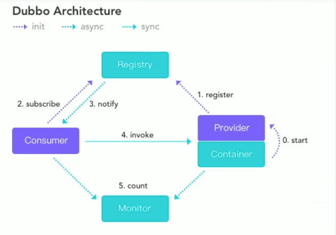

使用zookeeper作为注册中心，该项目中zookeeper使用docker搭建，版本为3.4.13

搭建dubbo-admin，在github下载，选择0.4.0版本

在 dubbo-admin中执行命令

```
mvn clean package -Dmaven.test.skip=true
```

在跑通RPC的过程中会遇到一些bug，dubbo无法注册，这里使用zookeeper作为注册中心，给消费者引入pom

```xml
<dependency>
            <groupId>org.apache.dubbo</groupId>
            <artifactId>dubbo</artifactId>
            <version>2.7.1</version>
        </dependency>
        <dependency>
            <groupId>org.apache.dubbo</groupId>
            <artifactId>dubbo-spring-boot-starter</artifactId>
            <version>2.7.1</version>
        </dependency>
        <!-- 引入zookeeper -->
        <dependency>
            <groupId>org.apache.curator</groupId>
            <artifactId>curator-framework</artifactId>
            <version>2.12.0</version>
        </dependency>
        <dependency>
            <groupId>org.apache.curator</groupId>
            <artifactId>curator-recipes</artifactId>
            <version>2.12.0</version>
        </dependency>
        <dependency>
            <groupId>org.apache.zookeeper</groupId>
            <artifactId>zookeeper</artifactId>
            <version>3.4.14</version>
            <!--排除这个slf4j-log4j12-->
            <exclusions>
                <exclusion>
                    <groupId>org.slf4j</groupId>
                    <artifactId>slf4j-log4j12</artifactId>
                </exclusion>
            </exclusions>
        </dependency>
```

配置文件：

```yml
server:
  port: 8083

spring:
  datasource:
    username: root
    password: root
    url: jdbc:mysql://127.0.0.1:3306/lottery?useSSL=false&serverTimezone=UTC
    driver-class-name: com.mysql.cj.jdbc.Driver

mybatis-plus:
  mapper-locations: classpath:/mybatis/mapper/*.xml
#  config-location:  classpath:/mybatis/config/mybatis-config.xml

dubbo:
  application:
    name: Lottery
    version: 1.0.0
    parameters:
      unicast: false
  registry:
    address: zookeeper://127.0.0.1:2181
    timeout: 30000
    protocol: zookeeper
  protocol:
    name: dubbo
    port: 20881
  scan:
    base-packages: com.banana69.lottery.rpc
```

消费者配置文件：

```yml
server:
  port: 8081

# Dubbo 广播方式配置
dubbo:
  application:
    name: Lottery-Test
    version: 1.0.0
  registry:
    #注册中心地址
    address: zookeeper://127。0。0。1:2181
    timeout: 30000
  protocol:
    name: dubbo
    port: 20880

```

对接口进行测试：

```java
@SpringBootTest
@RunWith(SpringRunner.class)
class ApiTest {

    private Logger logger = LoggerFactory.getLogger(ApiTest.class);

    @Reference(interfaceClass = IActivityBooth.class,url="dubbo://127.0.0.1:20881")
    private IActivityBooth activityBooth;


    @Test
    public void test_rpc() {
        ActivityReq req = new ActivityReq();
        req.setActivityId(100002L);
        ActivityRes result = activityBooth.queryActivityById(req);
        logger.info("测试结果：{}", JSON.toJSONString(result));
    }


}
```

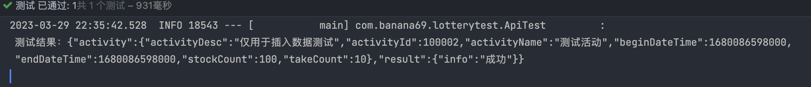


## 4. 抽奖活动策略表设计

### 4.1 需要建的表

一个满足业务需求的抽奖系统，需要提供抽奖活动配置、奖品概率配置、奖品梳理配置等内容，同时用户在抽奖后需要记录用户的抽奖数据，这就是一个抽奖活动系统的基本诉求。（后续可能会加上区块链的业务，与智能合约进行交互）

该项目提供的表包括

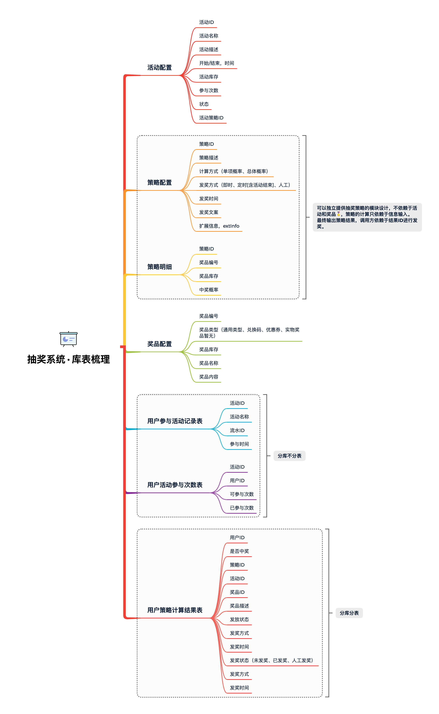

- 活动配置，activity：提供活动的基本配置
- 策略配置，strategy：用于配置抽奖策略，概率、玩法、库存、奖品
- 策略明细，strategy_detail：抽奖策略的具体明细配置
- 奖品配置，award：用于配置具体可以得到的奖品
- 用户参与活动记录表，user_take_activity：每个用户参与活动都会记录下他的参与信息，时间、次数
- 用户活动参与次数表，user_take_activity_count：用于记录当前参与了多少次
- 用户策略计算结果表，user_strategy_export_001~004：最终策略结果的一个记录，也就是奖品中奖信息的内容


### 4.2 建立表结构

1⃣️：**lottery**

```sql
create database lottery;

-- auto-generated definition
create table activity
(
    id            bigint auto_increment comment '自增ID',
    activityId    bigint       null comment '活动ID',
    activityName  varchar(64)  not null comment '活动名称',
    activityDesc  varchar(128) null comment '活动描述',
    beginDateTime datetime     not null comment '开始时间',
    endDateTime   datetime     not null comment '结束时间',
    stockCount    int          not null comment '库存',
    takeCount     int          null comment '每人可参与次数',
    state         int          null comment '活动状态：编辑、提审、撤审、通过、运行、拒绝、关闭、开启',
    creator       varchar(64)  not null comment '创建人',
    createTime    datetime     not null comment '创建时间',
    updateTime    datetime     not null comment '修改时间',
    constraint activity_id_uindex
        unique (id)
)
    comment '活动配置';

alter table activity
    add primary key (id);

-- auto-generated definition
create table award
(
    id           bigint(11) auto_increment comment '自增ID'
        primary key,
    awardId      bigint                             null comment '奖品ID',
    awardType    int(4)                             null comment '奖品类型（文字描述、兑换码、优惠券、实物奖品暂无）',
    awardCount   int                                null comment '奖品数量',
    awardName    varchar(64)                        null comment '奖品名称',
    awardContent varchar(128)                       null comment '奖品内容「文字描述、Key、码」',
    createTime   datetime default CURRENT_TIMESTAMP null comment '创建时间',
    updateTime   datetime default CURRENT_TIMESTAMP null comment 'updateTime'
)
    comment '奖品配置';

-- auto-generated definition
create table strategy
(
    id           bigint(11) auto_increment comment '自增ID'
        primary key,
    strategyId   bigint(11)   not null comment '策略ID',
    strategyDesc varchar(128) null comment '策略描述',
    strategyMode int(4)       null comment '策略方式「1:单项概率、2:总体概率」',
    grantType    int(4)       null comment '发放奖品方式「1:即时、2:定时[含活动结束]、3:人工」',
    grantDate    datetime     null comment '发放奖品时间',
    extInfo      varchar(128) null comment '扩展信息',
    createTime   datetime     null comment '创建时间',
    updateTime   datetime     null comment '修改时间',
    constraint strategy_strategyId_uindex
        unique (strategyId)
)
    comment '策略配置';

-- auto-generated definition
create table strategy_detail
(
    id         bigint(11) auto_increment comment '自增ID'
        primary key,
    strategyId bigint(11)    not null comment '策略ID',
    awardId    bigint(11)    null comment '奖品ID',
    awardCount int           null comment '奖品数量',
    awardRate  decimal(5, 2) null comment '中奖概率',
    createTime datetime      null comment '创建时间',
    updateTime datetime      null comment '修改时间'
)
    comment '策略明细';

```


2⃣️： **lottery_01.sql ~ lottery_02.sql**

```sql
create database lottery_01;

-- auto-generated definition
create table user_take_activity
(
    id           bigint    null,
    uId          tinytext  null,
    takeId       bigint    null,
    activityId   bigint    null,
    activityName tinytext  null,
    takeDate     timestamp null,
    takeCount    int       null,
    uuid         tinytext  null,
    createTime   timestamp null,
    updateTime   timestamp null
)
    comment '用户参与活动记录表';

-- auto-generated definition
create table user_take_activity_count
(
    id         bigint    null,
    uId        tinytext  null,
    activityId bigint    null,
    totalCount int       null,
    leftCount  int       null,
    createTime timestamp null,
    updateTime timestamp null
)
    comment '用户活动参与次数表';

-- auto-generated definition
create table user_strategy_export_001(id           bigint     null,uId          mediumtext null,activityId   bigint     null,orderId      bigint     null,strategyId   bigint     null,strategyType int        null,grantType    int        null,grantDate    timestamp  null,grantState   int        null,awardId      bigint     null,awardType    int        null,awardName    mediumtext null,awardContent mediumtext null,uuid         mediumtext null,createTime   timestamp  null,updateTime   timestamp  null) comment '用户策略计算结果表';
create table user_strategy_export_002(id           bigint     null,uId          mediumtext null,activityId   bigint     null,orderId      bigint     null,strategyId   bigint     null,strategyType int        null,grantType    int        null,grantDate    timestamp  null,grantState   int        null,awardId      bigint     null,awardType    int        null,awardName    mediumtext null,awardContent mediumtext null,uuid         mediumtext null,createTime   timestamp  null,updateTime   timestamp  null) comment '用户策略计算结果表';
create table user_strategy_export_003(id           bigint     null,uId          mediumtext null,activityId   bigint     null,orderId      bigint     null,strategyId   bigint     null,strategyType int        null,grantType    int        null,grantDate    timestamp  null,grantState   int        null,awardId      bigint     null,awardType    int        null,awardName    mediumtext null,awardContent mediumtext null,uuid         mediumtext null,createTime   timestamp  null,updateTime   timestamp  null) comment '用户策略计算结果表';
create table user_strategy_export_004(id           bigint     null,uId          mediumtext null,activityId   bigint     null,orderId      bigint     null,strategyId   bigint     null,strategyType int        null,grantType    int        null,grantDate    timestamp  null,grantState   int        null,awardId      bigint     null,awardType    int        null,awardName    mediumtext null,awardContent mediumtext null,uuid         mediumtext null,createTime   timestamp  null,updateTime   timestamp  null) comment '用户策略计算结果表';

```

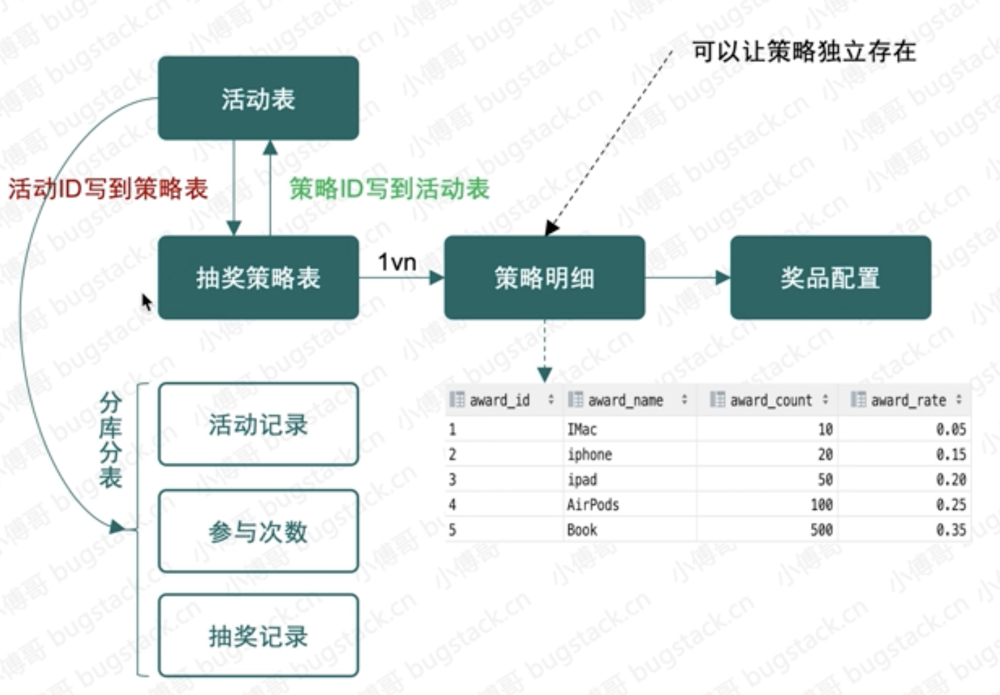


通常分库分表的几个常见方面； 1. 访问频率：对于高频访问的数据，可以将其存储在单独的数据库或表中，以提高读写性能。 2. 数据大小：对于大量的数据，可以将其拆分到多个表中，以减少单表的数据量，降低存储开销。 3. 数据类型：对于不同类型的数据，可以将其拆分到不同的数据库或表中，便于管理和查询。 4. 数据范围：对于不同范围的数据，可以将其拆分到不同的数据库或表中，便于数据的管理和查询。 分库分表的主要目的在于；数据分摊、提高QPS/TPS、分摊压力、提高可扩展性。比如；比如数据库的读写性能下降，或者单表数据量过大，这时候您就需要考虑进行分库分表操作了。通过拆分数据库，可以将单个数据库的压力分摊到多个数据库上，从而避免单个数据库的性能瓶颈，提高系统的性能和可扩展性。此外，分库分表还可以解决数据库存储容量的限制，提高数据库的存储能力。 另外在分库分表之后，数据的一致性会受到影响，数据库的管理和维护成本也会增加。因此，在考虑分库分表时，需要仔细权衡利弊，确定是否真的需要进行分库分表操作。也就是你的开发成本问题。因为有分库分表就会相应的引入 canal binlog同步、es、mq、xxl-job等分布式技术栈。

接下来我们会围绕这些库表一点点实现各个领域的功能，包括：抽奖策略领域、奖品发放领域、活动信息领域等


## 5. 抽奖策略领域模块开发

MVC与DDD的区别：

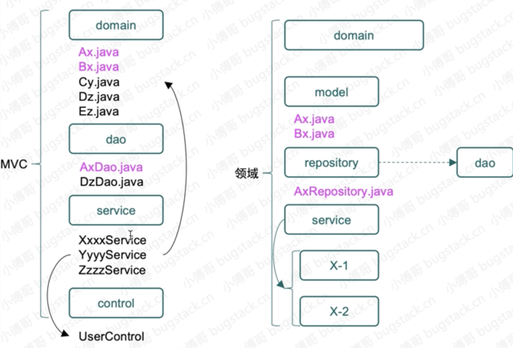

DDD优点：service包装各种领域的实现，Ax的对象只服务于Ax的仓储，没有其他业务领域使用这个对象，service也只专注于当前服务的实现。

**描述：在domain抽奖领域模块实现两种抽奖策略算法，包括：单项概率抽奖和整体概率抽奖，并提供统一的调用方式**

### 5.1 需求引出设计

**需求：**在一场营销抽奖活动玩法中，运营人员通常会配置不同形式的抽奖玩法。例如在转盘中配置12个奖品，每个奖品配置不同的中奖概率，当1个奖品被抽空了以后，那么再抽奖时，是剩余的奖品总概率均匀分配在11个奖品上，还是保持剩余11个奖品的中奖概率，如果抽到为空的奖品则表示未中奖。其实这两种方式在实际的运营过程中都会有所选取，主要是为了配合不同的玩法。

**设计**：在进行抽奖领域模块设计时，需要考虑到库表中要有对应的字段来区分当前运营选择的是什么样的抽奖策略。那么在开发实现上也会用到对应的`策略模式`的使用，两种抽奖算法可以算是不同的抽奖策略，最终提供统一的接口包装满足不同的抽奖功能调用。

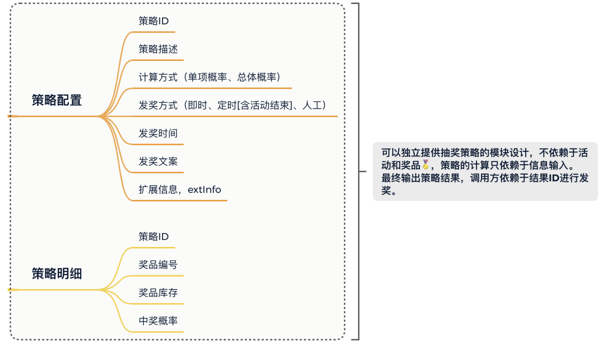

- 库表设计上需要策略配置和策略明细，他们的关系是`1 v n`
- 另外为了让抽奖策略成为可以独立配置和使用的领域模块，在策略表用不引入活动ID信息的配置。因为在建设领域模块的时候，我们需要把让这部分的领域实现具有可独立运行的特性，不让它被业务逻辑污染，它只是一种无业务逻辑的通用共性的功能领域模块，在业务组合的过程中可以使用此功能领域提供的标准接口。
- 通过这样的设计实现，就可以满足于不同业务场景的灵活调用，例如：有些业务场景是需要你直接来进行抽奖反馈中奖信息发送给用户，但还有一些因为用户下单支付才满足抽奖条件的场景对应的奖品是需要延时到账的，避免用户在下单后又进行退单，这样造成了刷单的风险。`所以有时候你的设计是与业务场景息息相关的`

### 5.2 领域功能结构

抽奖系统工程采用DDD架构 + Module模块方式搭建，lottery-domain 是专门用于开发领域服务的模块，不限于目前的抽奖策略在此模块下实现还有以后需要实现的活动领域、规则引擎、用户服务等都需要在这个模块实现对应的领域功能。

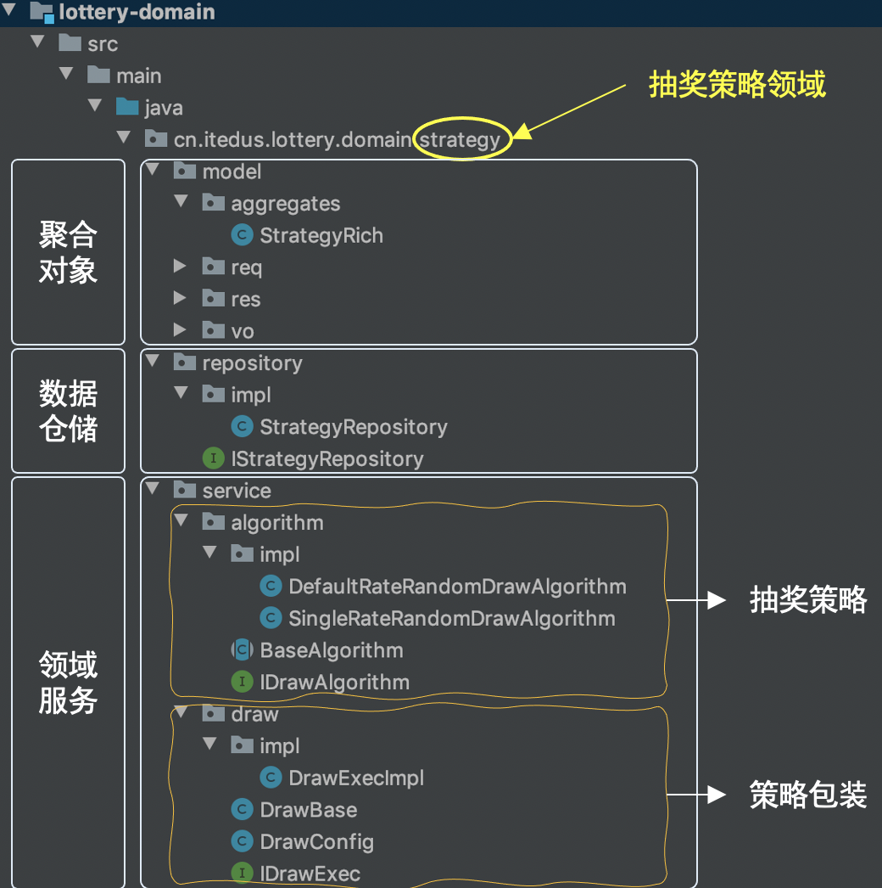

strategy 是第1个在 domain 下实现的抽奖策略领域，在领域功能开发的服务下主要含有model、repository、service三块区域，接下来分别介绍下在抽奖领域中这三块区域都做了哪些事情。

- model，用于提供vo、req、res 和 aggregates 聚合对象。
- repository，提供仓储服务，其实也就是对Mysql、Redis等数据的统一包装。
- service，是具体的业务领域逻辑实现层，在这个包下定义了algorithm抽奖算法实现和具体的抽奖策略包装 draw 层，对外提供抽奖接口 IDrawExec#doDrawExec

### 5.3 抽奖算法实现

两种抽奖算法描述，场景A20%、B30%、C50%

- **总体概率**：如果A奖品抽空后，B和C奖品的概率按照 `3:5` 均分，相当于B奖品中奖概率由 `0.3` 升为 `0.375`
- **单项概率**：如果A奖品抽空后，B和C保持目前中奖概率，用户抽奖扔有20%中为A，因A库存抽空则结果展示为未中奖。*为了运营成本，通常这种情况的使用的比较多*

#### 5.3.1 定义接口

`com.banana69.lottery.domain.strategy.service.algorithm.IDrawAlgorithm`

```java
public interface IDrawAlgorithm {

    /**
     * SecureRandom 生成随机数，索引到对应的奖品信息返回结果
     *
     * @param strategyId 策略ID
     * @param excludeAwardIds 排除掉已经不能作为抽奖的奖品ID，留给风控和空库存使用
     * @return 中奖结果
     */
    String randomDraw(Long strategyId, List<String> excludeAwardIds);
}
```

无论任何一种抽奖算法的使用，都以这个接口作为标准的抽奖接口进行抽奖。`strategyId` 是抽奖策略、`excludeAwardIds` 排除掉已经不能作为抽奖的奖品ID，留给风控和空库存使用

#### 5.3.2 总体概率算法

**算法描述**：分别把A、B、C对应的概率值转换成阶梯范围值，A=(0~0.2」、B=(0.2-0.5」、C=(0.5-1.0」，当使用随机数方法生成一个随机数后，与阶梯范围值进行循环比对找到对应的区域，匹配到中奖结果。

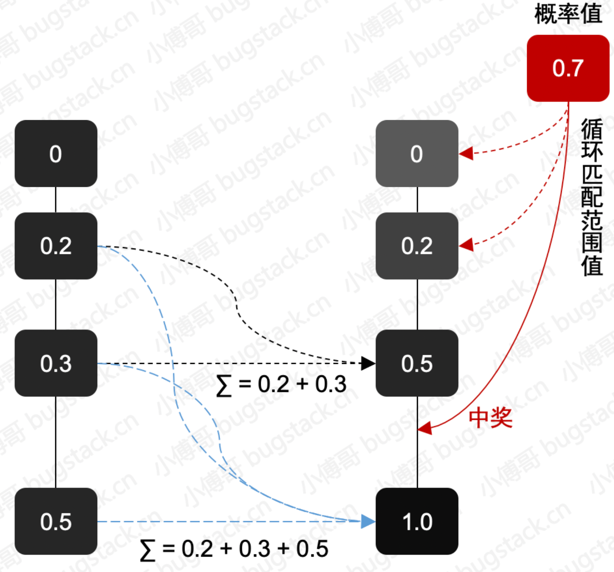

如果使用常见的抽奖算法，设置搜索概率，给不同的奖品设置不同的概率，给它们对应的不同范围值，但在高并发的场景下，如果大家都抽到了同一个区间，性能曲线波动会比较频繁，时间范围就比较大。

**这里使用斐波那契算法**

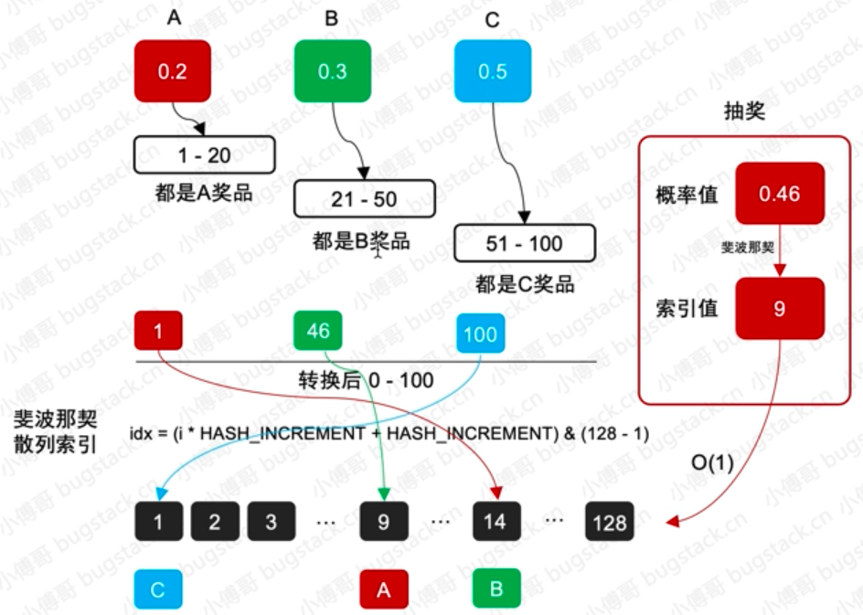

给不同的奖品设置一个概率码，不同的码对应不同的奖品，使用128个长度来存放这些不同奖品对应的数值，通过斐波那契算法将概率只转换为对应的索引值，在一些并发场景的下的抽奖效率会更高一些。

**为什么不使用HashMap：**可能存在hash碰撞，当产生碰撞后产生一个数据链，当超过8个时会转换成红黑树，斐波那契散列痛通过黄金分割点进行增量计算，散列效果更好，在最小空间下实现不碰撞。hashmap的负载因子决定哈希桶的大小，占用的空间也会更大。


```java
public class DefaultRateRandomDrawAlgorithm extends BaseAlgorithm {

    @Override
    public String randomDraw(Long strategyId, List<String> excludeAwardIds) {

        BigDecimal differenceDenominator = BigDecimal.ZERO;

        // 排除掉不在抽奖范围的奖品ID集合
        List<AwardRateInfo> differenceAwardRateList = new ArrayList<>();
        List<AwardRateInfo> awardRateIntervalValList = awardRateInfoMap.get(strategyId);
        for (AwardRateInfo awardRateInfo : awardRateIntervalValList) {
            String awardId = awardRateInfo.getAwardId();
            if (excludeAwardIds.contains(awardId)) {
                continue;
            }
            differenceAwardRateList.add(awardRateInfo);
            differenceDenominator = differenceDenominator.add(awardRateInfo.getAwardRate());
        }

        // 前置判断
        if (differenceAwardRateList.size() == 0) return "";
        if (differenceAwardRateList.size() == 1) return differenceAwardRateList.get(0).getAwardId();

        // 获取随机概率值
        SecureRandom secureRandom = new SecureRandom();
        int randomVal = secureRandom.nextInt(100) + 1;

        // 循环获取奖品
        String awardId = "";
        int cursorVal = 0;
        for (AwardRateInfo awardRateInfo : differenceAwardRateList) {
            int rateVal = awardRateInfo.getAwardRate().divide(differenceDenominator, 2, BigDecimal.ROUND_UP).multiply(new BigDecimal(100)).intValue();
            if (randomVal <= (cursorVal + rateVal)) {
                awardId = awardRateInfo.getAwardId();
                break;
            }
            cursorVal += rateVal;
        }

        // 返回中奖结果
        return awardId;
    }

}

```

- 首先要从总的中奖列表中排除掉那些被排除掉的奖品，这些奖品会涉及到概率的值重新计算。
- 如果排除后剩下的奖品列表小于等于1，则可以直接返回对应信息
- 接下来就使用随机数工具生产一个100内的随值与奖品列表中的值进行循环比对，算法时间复杂度O(n)


####  单项概率算法

**算法描述**：单项概率算法不涉及奖品概率重新计算的问题，那么也就是说我们分配好的概率结果是可以固定下来的。好，这里就有一个可以优化的算法，不需要在轮训匹配O(n)时间复杂度来处理中奖信息，而是可以根据概率值存放到HashMap或者自定义散列数组进行存放结果，这样就可以根据概率值直接定义中奖结果，时间复杂度由O(n)降低到O(1)。这样的设计在一般电商大促并发较高的情况下，达到优化接口响应时间的目的。

```java
@Component("singleRateRandomDrawAlgorithm")
public class singleRateRandomDrawAlgorithm extends BaseAlgorithm {
    @Override
    public String randomDraw(Long strategyId, List<String> excludeAwardIds) {
        // 获取策略对应的元组
        String[] rateTuple = super.rateTupleMap.get(strategyId);
        assert rateTuple != null;

        // 随机索引
        int randomVal = new SecureRandom().nextInt(100) + 1;
        int idx = super.hashIdx(randomVal);

        // 返回结果
        String awardId = rateTuple[idx];
        if(excludeAwardIds.contains(awardId)){
            return "未中奖";
        }

        return awardId;
    }
}
```

#### 测试结果

```java
@SpringBootTest
@RunWith(SpringRunner.class)
public class DrawAlgorithmTest {

    @Resource(name = "defaultRateRandomDrawAlgorithm")
    private IDrawAlgorithm randomDrawAlgorithm;

    @Resource(name = "singleRateRandomDrawAlgorithm")
    private IDrawAlgorithm singleRateRandomDrawAlgorithm;


    @Before
    public void init() {
        // 奖品信息
        List<AwardRateInfo> strategyList = new ArrayList<>();
        strategyList.add(new AwardRateInfo("一等奖：IMac", new BigDecimal("0.05")));
        strategyList.add(new AwardRateInfo("二等奖：iphone", new BigDecimal("0.15")));
        strategyList.add(new AwardRateInfo("三等奖：ipad", new BigDecimal("0.20")));
        strategyList.add(new AwardRateInfo("四等奖：AirPods", new BigDecimal("0.25")));
        strategyList.add(new AwardRateInfo("五等奖：充电宝", new BigDecimal("0.35")));

        // 初始数据
        randomDrawAlgorithm.initRateTuple(100001L, strategyList);

        singleRateRandomDrawAlgorithm.initRateTuple(100002L, strategyList);


    }

    @Test
    public void test_randomDrawAlgorithm(){
        List<String> excludes = new ArrayList<String>();
        excludes.add("二等奖: iPhone");
        excludes.add("四等奖: Airpods");

        for(int i = 0; i < 20; i++){
            System.out.println("中奖结果：" +
                    randomDrawAlgorithm.randomDraw(100001L, excludes));
        }
    }

    @Test
    public void test_singleRateRandomDrawAlgorithm(){
        List<String> excludes = new ArrayList<String>();
        excludes.add("二等奖: iPhone");
        excludes.add("四等奖: Airpods");
        excludes.add("一等奖：IMac");
        excludes.add("三等奖：ipad");
        excludes.add("五等奖：充电宝");

        for(int i = 0; i < 20; i++){
            System.out.println("中奖结果：" +
                    singleRateRandomDrawAlgorithm.randomDraw(100002L, excludes));
        }
    }

}
```

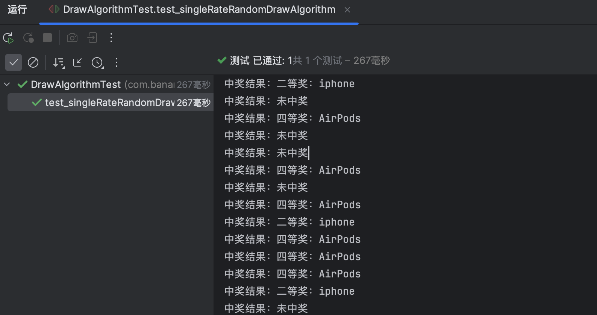


## 6.模板模式处理抽奖流程

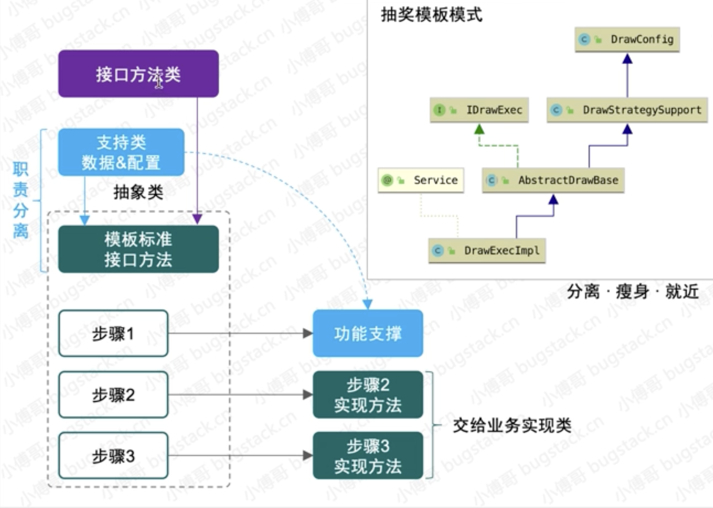

将接口的职责，功能分离，不需要把所有的内容都放到抽象类中


