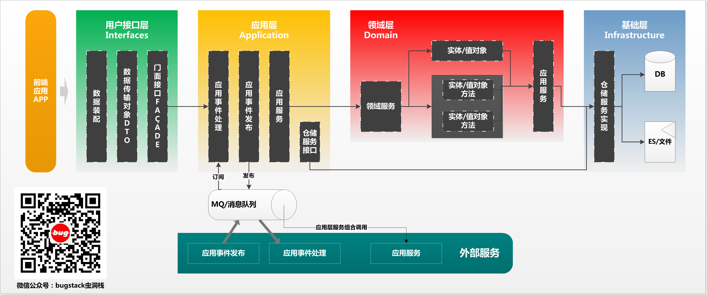
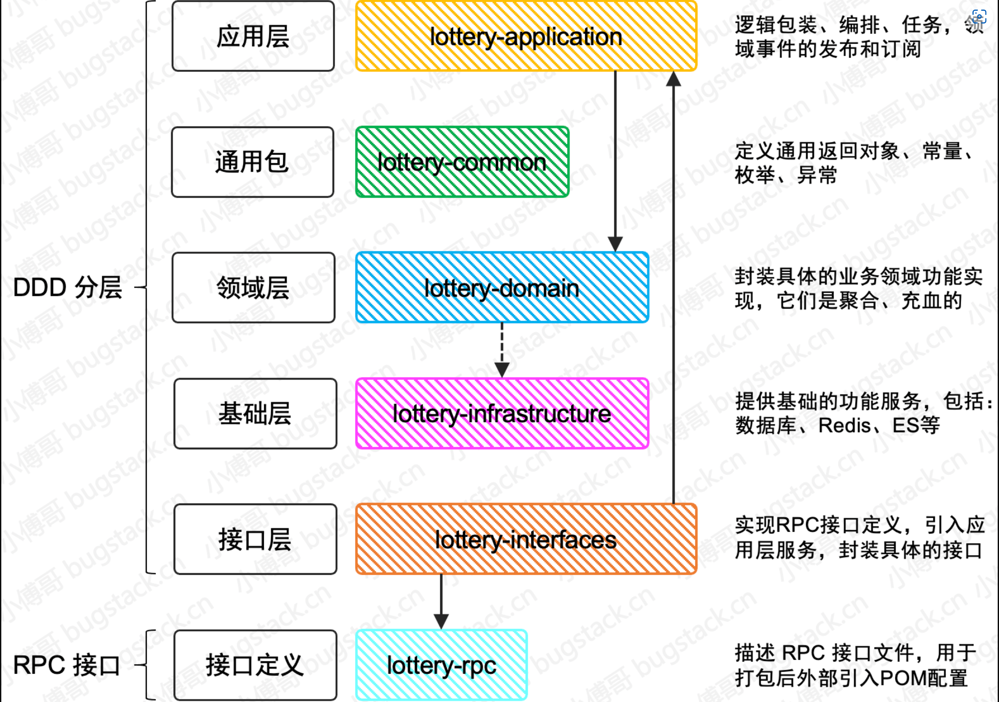
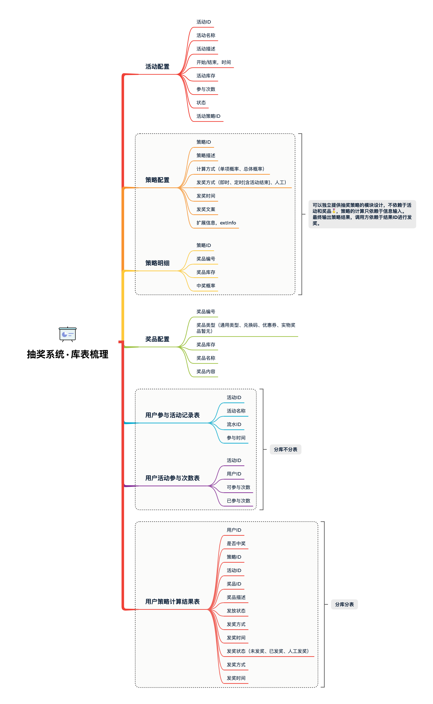

# Lottery

基于Springboot，Dubbo 等开发的分布式抽奖系统

### 第一部分 领域开发

## 1. 环境 配置 规范


## 2. 搭建(DDD + RPC)架构

DDD（Domain-Driven Design 领域驱动设计）是由Eric Evans最先提出，目的是对软件所涉及到的领域进行建模，以应对系统规模过大时引起的软件复杂性的问题。整个过程大概是这样的，开发团队和领域专家一起通过 通用语言(Ubiquitous Language)去理解和消化领域知识，从领域知识中提取和划分为一个一个的子领域（核心子域，通用子域，支撑子域），并在子领域上建立模型，再重复以上步骤，这样周而复始，构建出一套符合当前领域的模型。

依靠领域驱动设计的设计思想，通过事件风暴建立领域模型，合理划分领域逻辑和物理边界，建立领域对象及服务矩阵和服务架构图，定义符合DDD分层架构思想的代码结构模型，保证业务模型与代码模型的一致性。通过上述设计思想、方法和过程，指导团队按照DDD设计思想完成微服务设计和开发。

- 拒绝泥球小单体、拒绝污染功能与服务、拒绝一加功能排期一个月
- 架构出高可用极易符合互联网高速迭代的应用服务
- 物料化、组装化、可编排的服务，提高人效



- **应用层{application}**

  - 应用服务位于应用层。用来表述应用和用户行为，负责服务的组合、编排和转发，负责处理业务用例的执行顺序以及结果的拼装。

  - 应用层的服务包括应用服务和领域事件相关服务。

  - 应用服务可对微服务内的领域服务以及微服务外的应用服务进行组合和编排，或者对基础层如文件、缓存等数据直接操作形成应用服务，对外提供粗粒度的服务。

  - 领域事件服务包括两类：领域事件的发布和订阅。通过事件总线和消息队列实现异步数据传输，实现微服务之间的解耦。

- **领域层{domain}**

  - 领域服务位于领域层，为完成领域中跨实体或值对象的操作转换而封装的服务，领域服务以与实体和值对象相同的方式参与实施过程。

  - 领域服务对同一个实体的一个或多个方法进行组合和封装，或对多个不同实体的操作进行组合或编排，对外暴露成领域服务。领域服务封装了核心的业务逻辑。实体自身的行为在实体类内部实现，向上封装成领域服务暴露。

  - 为隐藏领域层的业务逻辑实现，所有领域方法和服务等均须通过领域服务对外暴露。

  - 为实现微服务内聚合之间的解耦，原则上禁止跨聚合的领域服务调用和跨聚合的数据相互关联。

- **基础层{infrastructure}**

  - 基础服务位于基础层。为各层提供资源服务（如数据库、缓存等），实现各层的解耦，降低外部资源变化对业务逻辑的影响。

  - 基础服务主要为仓储服务，通过依赖反转的方式为各层提供基础资源服务，领域服务和应用服务调用仓储服务接口，利用仓储实现持久化数据对象或直接访问基础资源。

- **接口层{interfaces}**
  - 接口服务位于用户接口层，用于处理用户发送的Restful请求和解析用户输入的配置文件等，并将信息传递给应用层。

**DDD是在MVC的基础上可以更加明确了房间的布局**

DDD结构它是一种充血模型结构，所有的服务实现都以领域为核心，应用层定义接口，领域层实现接口，领域层定义数据仓储，基础层实现数据仓储中关于DAO和Redis的操作，但同时几方又有互相的依赖。那么这样的结构再开发独立领域提供 http 接口时候，并不会有什么问题体现出来。但如果这个时候需要引入 RPC 框架，就会暴露问题了，因为使用 RPC 框架的时候，需要对外提供描述接口信息的 Jar 让外部调用方引入才可以通过反射调用到具体的方法提供者，那么这个时候，RPC 需要暴露出来，而 DDD 的系统结构又比较耦合，怎么进行模块化的分离就成了问题点。所以我们本章节在模块系统结构搭建的时候，也是以解决此项问题为核心进行处理的。

**DDD + RPC，模块分离系统搭建**



如果按照模块化拆分，那么会需要做一些处理，包括：

1. 应用层，不再给领域层定义接口，而是自行处理对领域层接口的包装。否则领域层既引入了应用层的Jar，应用层也引入了领域层的Jar，就会出现循环依赖的问题。
2. 基础层中的数据仓储的定义也需要从领域层剥离，否则也会出现循环依赖的问题。
3. RPC 层定义接口描述，包括：入参Req、出参Res、DTO对象，接口信息，这些内容定义出来的Jar给接口层使用，也给外部调用方使用。


## 3. 跑通广播模式RPC过程调用

### 一、创建抽奖活动表

抽奖活动的设计和开发过程中，涉及到的表信息包括：活动表、奖品表、策略表、规则表、用户参与表、中奖信息表等。

首先创建一个活动表，用于实现系统对数据库的CRUD操作，也就可以被RPC接口调用，在后续再进行优化。

**活动表(activity)**

```sql
CREATE TABLE `activity` (
  `id` bigint(20) NOT NULL AUTO_INCREMENT COMMENT '自增ID',
  `activity_id` bigint(20) NOT NULL COMMENT '活动ID',
  `activity_name` varchar(64) CHARACTER SET utf8mb4 DEFAULT NULL COMMENT '活动名称',
  `activity_desc` varchar(128) CHARACTER SET utf8mb4 DEFAULT NULL COMMENT '活动描述',
  `begin_date_time` datetime DEFAULT NULL COMMENT '开始时间',
  `end_date_time` datetime DEFAULT NULL COMMENT '结束时间',
  `stock_count` int(11) DEFAULT NULL COMMENT '库存',
  `take_count` int(11) DEFAULT NULL COMMENT '每人可参与次数',
  `state` tinyint(2) DEFAULT NULL COMMENT '活动状态：1编辑、2提审、3撤审、4通过、5运行(审核通过后worker扫描状态)、6拒绝、7关闭、8开启',
  `creator` varchar(64) CHARACTER SET utf8mb4 DEFAULT NULL COMMENT '创建人',
  `create_time` datetime DEFAULT CURRENT_TIMESTAMP COMMENT '创建时间',
  `update_time` datetime DEFAULT CURRENT_TIMESTAMP COMMENT '修改时间',
  PRIMARY KEY (`id`),
  UNIQUE KEY `unique_activity_id` (`activity_id`)
) ENGINE=InnoDB AUTO_INCREMENT=2 DEFAULT CHARSET=utf8mb4 COLLATE=utf8mb4_bin COMMENT='活动配置';

```

活动表：是一个用于配置抽奖活动的总表，用于存放活动信息，包括：ID、名称、描述、时间、库存、参与次数等。

### 二、POM 文件配置

按照现有工程的结构模块分层，包括：

- lottery-application，应用层，引用：`domain`
- lottery-common，通用包，引用：`无`
- lottery-domain，领域层，引用：`infrastructure`
- lottery-infrastructure，基础层，引用：`无`
- lottery-interfaces，接口层，引用：`application`、`rpc`
- lottery-rpc，RPC接口定义层，引用：`common`

**lottery-rpc配置**

```xml
<parent>
    <artifactId>Lottery</artifactId>
    <groupId>com.banana69.lottery</groupId>
    <version>1.0-SNAPSHOT</version>
</parent>
<modelVersion>4.0.0</modelVersion>
<artifactId>lottery-rpc</artifactId>

<packaging>jar</packaging>

<dependencies>
    <dependency>
        <groupId>cn.itedus.lottery</groupId>
        <artifactId>lottery-common</artifactId>
        <version>1.0-SNAPSHOT</version>
    </dependency>
</dependencies>

<build>
    <finalName>lottery-rpc</finalName>
    <plugins>
        <!-- 编译plugin -->
        <plugin>
            <groupId>org.apache.maven.plugins</groupId>
            <artifactId>maven-compiler-plugin</artifactId>
            <configuration>
                <source>${jdk.version}</source>
                <target>${jdk.version}</target>
                <compilerVersion>1.8</compilerVersion>
            </configuration>
        </plugin>
    </plugins>
</build>
```

**lottery-interfaces配置**

```xml
<artifactId>lottery-interfaces</artifactId>

<packaging>war</packaging>

<dependencies>
    <dependency>
        <groupId>org.springframework.boot</groupId>
        <artifactId>spring-boot-starter-web</artifactId>
    </dependency>
    ...
</dependencies>

<build>
    <finalName>Lottery</finalName>
    <resources>
        <resource>
            <directory>src/main/resources</directory>
            <filtering>true</filtering>
            <includes>
                <include>**/**</include>
            </includes>
        </resource>
    </resources>
    <testResources>
        <testResource>
            <directory>src/test/resources</directory>
            <filtering>true</filtering>
            <includes>
                <include>**/**</include>
            </includes>
        </testResource>
    </testResources>
    <plugins>
        <plugin>
            <groupId>org.springframework.boot</groupId>
            <artifactId>spring-boot-maven-plugin</artifactId>
        </plugin>
        <plugin>
            <groupId>org.apache.maven.plugins</groupId>
            <artifactId>maven-compiler-plugin</artifactId>
            <configuration>
                <source>8</source>
                <target>8</target>
            </configuration>
        </plugin>
    </plugins>
</build>

```

lottery-interfaces 是整个程序的出口，也是用于构建 War 包的工程模块，所以你会看到一个 `<packaging>war</packaging>` 的配置。

在 dependencies 会包含所有需要用到的 SpringBoot 配置，也会包括对其他各个模块的引入。

在 build 构建配置上还会看到一些关于测试包的处理，比如这里包括了资源的引入也可以包括构建时候跳过测试包的配置。

**配置广播模式Dubbo**

最早 RPC 的设计和使用都是依赖于注册中心，那就是需要把服务接口信息在程序启动的时候，推送到一个统一的注册中心，在其他需要调用 RPC 接口的服务上再通过注册中心的均衡算法来匹配可以连接的接口落到本地保存和更新。那么这样的标准的使用方式可以提供更大的连接数和更强的负载均衡作用，但目前我们这个以学习实践为目的的工程开发则需要尽可能减少学习成本，也就需要在开发阶段少一些引入一些额外的配置，那么目前使用广播模式就非常适合，以后也可以直接把 Dubbo 配置成注册中心模式。

```yml
# Dubbo 广播方式配置
dubbo:
  application:
    name: Lottery
    version: 1.0.0
  registry:
    address: N/A #multicast://224.5.6.7:1234
  protocol:
    name: dubbo
    port: 20880
  scan:
    base-packages: cn.itedus.lottery.rpc

```

广播模式的配置唯一区别在于注册地址，`registry.address = multicast://224.5.6.7:1234`，服务提供者和服务调用者都需要配置相同的📢广播地址。或者配置为 N/A 用于直连模式使用

application，配置应用名称和版本

protocol，配置的通信协议和端口

scan，相当于 Spring 中自动扫描包的地址，可以把此包下的所有 rpc 接口都注册到服务中

**搭建测试工程调用 RPC**

为了测试 RPC 接口的调用以及后续其他逻辑的验证，这里需要创建一个测试工程：Lottery-Test这个工程中用于引入 RPC 接口的配置和同样广播模式的调用。


使用zookeeper作为注册中心，该项目中zookeeper使用docker搭建，版本为3.4.13

搭建dubbo-admin，在github下载，选择0.4.0版本

在 dubbo-admin中执行命令

```
mvn clean package -Dmaven.test.skip=true
```

在跑通RPC的过程中会遇到一些bug，dubbo无法注册，这里使用zookeeper作为注册中心，给消费者引入pom

```xml
<dependency>
            <groupId>org.apache.dubbo</groupId>
            <artifactId>dubbo</artifactId>
            <version>2.7.1</version>
        </dependency>
        <dependency>
            <groupId>org.apache.dubbo</groupId>
            <artifactId>dubbo-spring-boot-starter</artifactId>
            <version>2.7.1</version>
        </dependency>
        <!-- 引入zookeeper -->
        <dependency>
            <groupId>org.apache.curator</groupId>
            <artifactId>curator-framework</artifactId>
            <version>2.12.0</version>
        </dependency>
        <dependency>
            <groupId>org.apache.curator</groupId>
            <artifactId>curator-recipes</artifactId>
            <version>2.12.0</version>
        </dependency>
        <dependency>
            <groupId>org.apache.zookeeper</groupId>
            <artifactId>zookeeper</artifactId>
            <version>3.4.14</version>
            <!--排除这个slf4j-log4j12-->
            <exclusions>
                <exclusion>
                    <groupId>org.slf4j</groupId>
                    <artifactId>slf4j-log4j12</artifactId>
                </exclusion>
            </exclusions>
        </dependency>
```

配置文件：

```yml
server:
  port: 8083

spring:
  datasource:
    username: root
    password: root
    url: jdbc:mysql://127.0.0.1:3306/lottery?useSSL=false&serverTimezone=UTC
    driver-class-name: com.mysql.cj.jdbc.Driver

mybatis-plus:
  mapper-locations: classpath:/mybatis/mapper/*.xml
#  config-location:  classpath:/mybatis/config/mybatis-config.xml

dubbo:
  application:
    name: Lottery
    version: 1.0.0
    parameters:
      unicast: false
  registry:
    address: zookeeper://127.0.0.1:2181
    timeout: 30000
    protocol: zookeeper
  protocol:
    name: dubbo
    port: 20881
  scan:
    base-packages: com.banana69.lottery.rpc
```

消费者配置文件：

```yml
server:
  port: 8081

# Dubbo 广播方式配置
dubbo:
  application:
    name: Lottery-Test
    version: 1.0.0
  registry:
    #注册中心地址
    address: zookeeper://127。0。0。1:2181
    timeout: 30000
  protocol:
    name: dubbo
    port: 20880

```

对接口进行测试：

```java
@SpringBootTest
@RunWith(SpringRunner.class)
class ApiTest {

    private Logger logger = LoggerFactory.getLogger(ApiTest.class);

    @Reference(interfaceClass = IActivityBooth.class,url="dubbo://127.0.0.1:20881")
    private IActivityBooth activityBooth;


    @Test
    public void test_rpc() {
        ActivityReq req = new ActivityReq();
        req.setActivityId(100002L);
        ActivityRes result = activityBooth.queryActivityById(req);
        logger.info("测试结果：{}", JSON.toJSONString(result));
    }


}
```


## 4. 抽奖活动策略表设计

### 4.1 需要建的表

一个满足业务需求的抽奖系统，需要提供抽奖活动配置、奖品概率配置、奖品梳理配置等内容，同时用户在抽奖后需要记录用户的抽奖数据，这就是一个抽奖活动系统的基本诉求。（后续可能会加上区块链的业务，与智能合约进行交互）

该项目提供的表包括



- 活动配置，activity：提供活动的基本配置
- 策略配置，strategy：用于配置抽奖策略，概率、玩法、库存、奖品
- 策略明细，strategy_detail：抽奖策略的具体明细配置
- 奖品配置，award：用于配置具体可以得到的奖品
- 用户参与活动记录表，user_take_activity：每个用户参与活动都会记录下他的参与信息，时间、次数
- 用户活动参与次数表，user_take_activity_count：用于记录当前参与了多少次
- 用户策略计算结果表，user_strategy_export_001~004：最终策略结果的一个记录，也就是奖品中奖信息的内容


### 4.2 建立表结构

